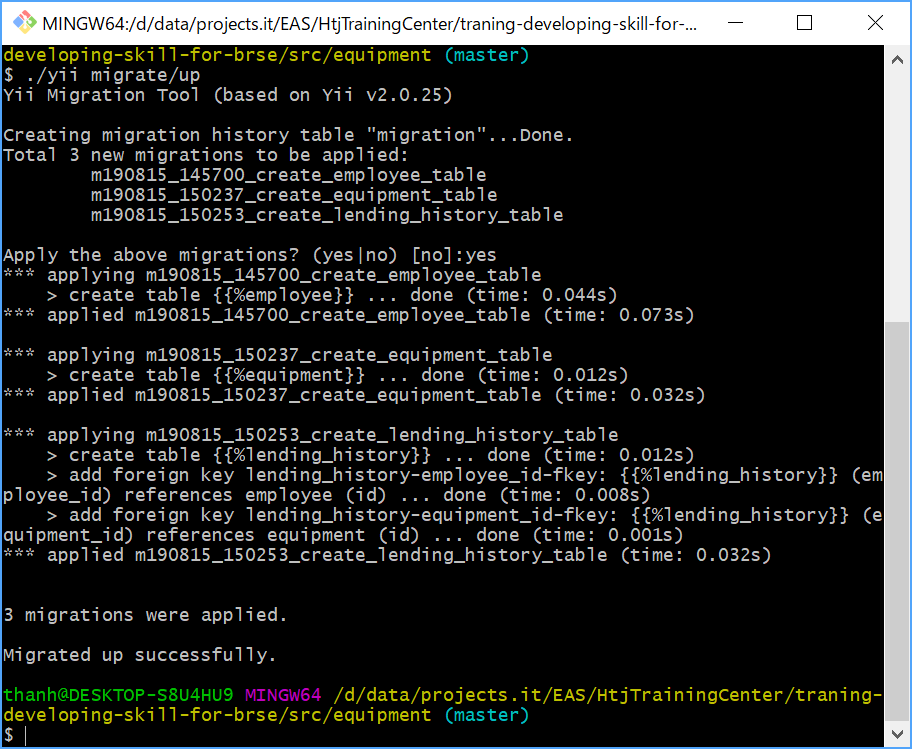
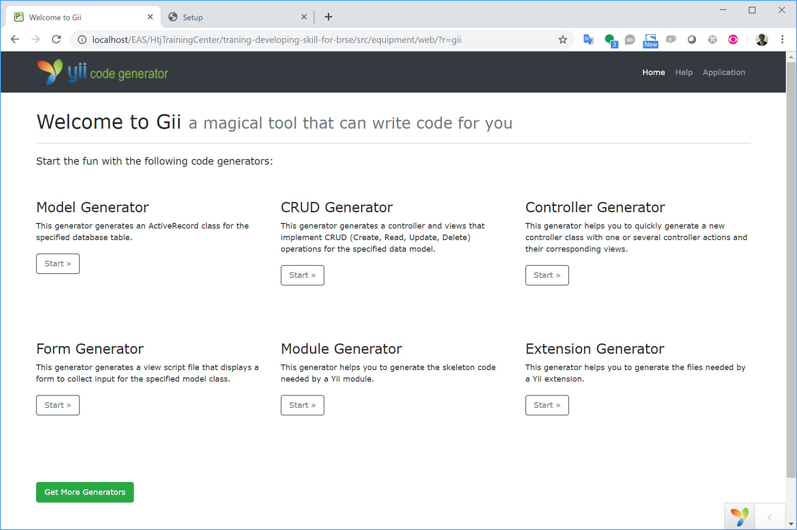
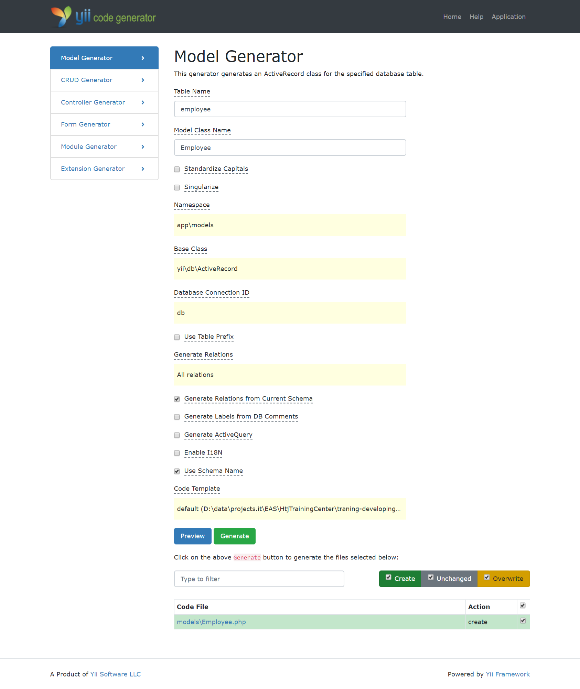
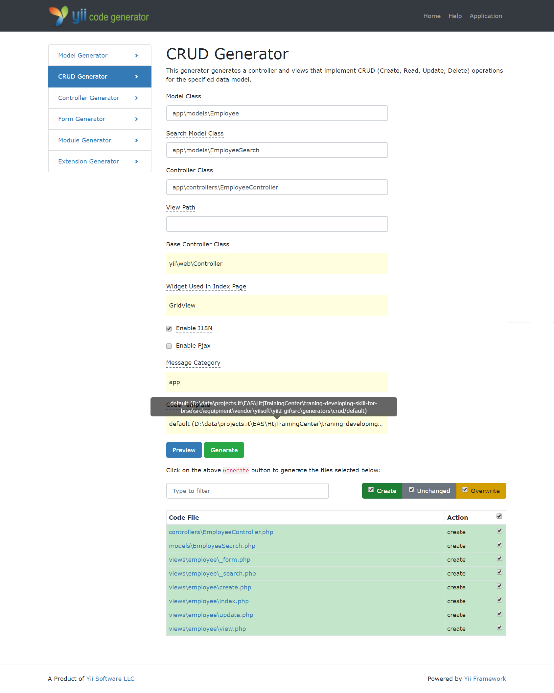
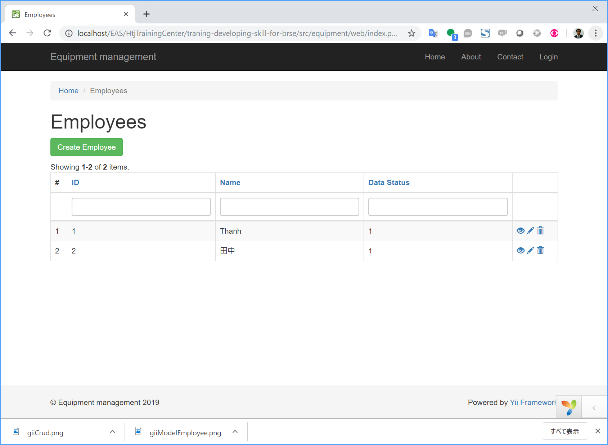
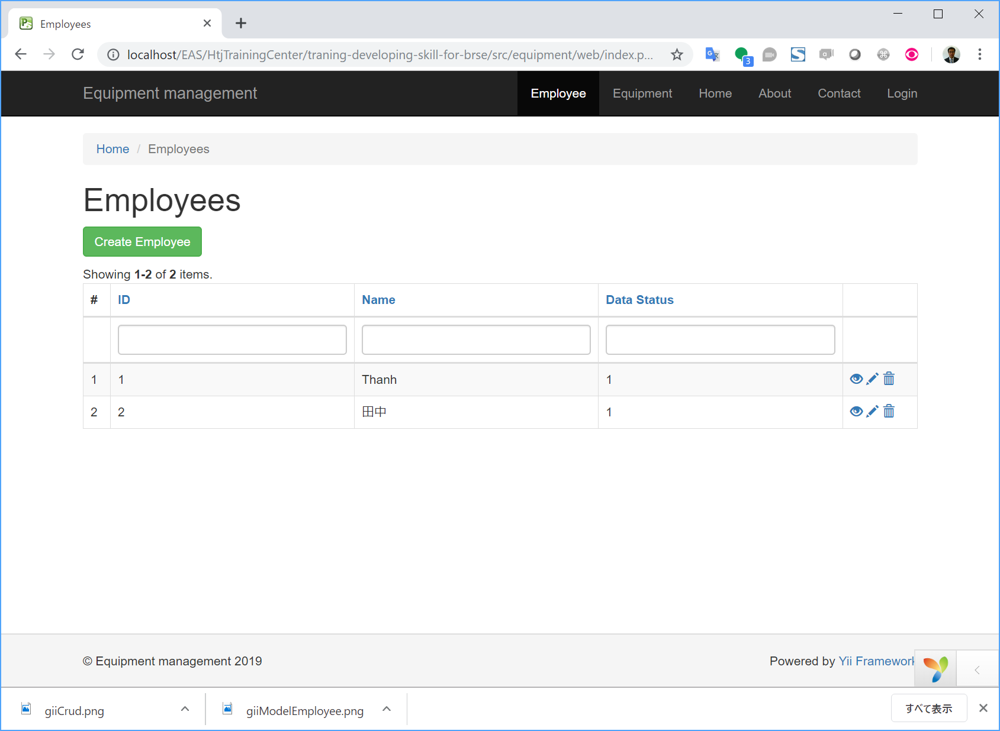

# Create DB schema, model, CRUD

## Steps to do
1. Design DB
2. Create postgres empty database
3. Setup the database info in application config
4. Create tables using migration
5. Create model classes
6. Create CRUD functions
7. Add items to the menu

## Design DB

  

### Practice

* We use field name *name*, not *employee_name* in the table *employee*.
  Any type of naming is OK, but we preffer to use it in type of *employee.name* or *$employee->name*, not *employee.employee_name* or *$employee->employee_name*.

## Create postgres empty database

1. Create PostgreSQL database
  * Open PostgreSQL shell
    ```shell
    psql -U postgres
    ```
  * Run SQL command
    ```SQL
    CREATE USER simple_equipment_management WITH PASSWORD 'simple_equipment_management';
    
    CREATE DATABASE simple_equipment_management;
    GRANT ALL PRIVILEGES ON DATABASE simple_equipment_management TO simple_equipment_management;
    
    \q
    ```
## Setup the database info in application config

Open *src\equipment\config\db.php* and set the database information.
```
    'dsn' => 'pgsql:host=localhost;dbname=simple_equipment_management',
    'username' => 'simple_equipment_management',
    'password' => 'simple_equipment_management',
```

## Create tables using migration

### Create 3 migration files

```
cd src/equipment/
./yii migrate/create create_employee_table
./yii migrate/create create_equipment_table
./yii migrate/create create_lending_history_table
```

Screen shot of `./yii migrate/create create_employee_table`


Three migration files are created in *src\equipment\migrations*
* m190815_145700_create_employee_table.php
* m190815_150237_create_equipment_table.php
* m190815_150253_create_lending_history_table.php

### Edit migration files to add columns

```php
class m190815_145700_create_employee_table extends Migration
{
    /**
     * {@inheritdoc}
     */
    public function safeUp()
    {
        $this->createTable('{{%employee}}', [
            'id' => $this->primaryKey(),
            'name' => $this->string(),
            'data_status' => $this->integer(),
        ]);
    }
}
```

```php
class m190815_150237_create_equipment_table extends Migration
{
    /**
     * {@inheritdoc}
     */
    public function safeUp()
    {
        $this->createTable('{{%equipment}}', [
            'id' => $this->primaryKey(),
            'code' => $this->string(),
            'type' => $this->integer(),
            'name' => $this->string(),
            'model_number' => $this->string(),
            'serial_number' => $this->string(),
            'specification' => $this->string(),
            'accessory' => $this->text(),
            'remarks' => $this->text(),
            'buy_date' => $this->date(),
            'payment_amount' => $this->integer(),
        ]);
    }
}
```

```php
class m190815_150253_create_lending_history_table extends Migration
{
    protected $table = '{{%lending_history}}';

    /**
     * {@inheritdoc}
     */
    public function safeUp()
    {
        $this->createTable($this->table, [
            'id' => $this->primaryKey(),
            'employee_id' => $this->integer(),
            'equipment_id' => $this->integer(),
            'lending_date' => $this->date(),
            'return_date' => $this->date(),
            'remarks' => $this->text(),
            'lending_status' => $this->integer(),
        ]);
        $this->addForeignKey('lending_history-employee_id-fkey', $this->table, 'employee_id', 'employee', 'id');
        $this->addForeignKey('lending_history-equipment_id-fkey', $this->table, 'equipment_id', 'equipment', 'id');
    }
}
```

### Practice

* For flag field, use *integer* or *tinyint*?
* *id* field and foreign key field.
* Data type *string* or *text*
* varchar(32) or varchar(255). Make life simpler. DB data type may larger than system requirement.

### Run migration files

```
./yii migrate/up
```


## Create model classes

* Access to gii
  http://localhost/EAS/HtjTrainingCenter/traning-developing-skill-for-brse/src/equipment/web/?r=gii
  
* Create three models: *Employee*, *Equipment*, *LendingHistory*
  Input table name, model class name, then click "Generate"
  

### Practice

* Use diff button.
* I18n option.

## Create CRUD functions

* Create CRUD for two models: *Employee*, *Equipment*
  Input table name, model class name, then click "Generate"
  

* Don't create CRUD for *LendingHistory* model.

* Update index screen
  
  * delete unecessary column such as id
  * Add filter by dropdown for data_status.

* Update view
  * Str property
  * OptionArr

* Form
  * Select by dropdown or radio list?
  * Input or textarea
  * Date selection

## Add items to the menu

* Add following items into *src\equipment\views\layouts\main.php*
```php
            ['label' => 'Employee', 'url' => ['/employee/index']],
            ['label' => 'Equipment', 'url' => ['/equipment/index']],
```


* Explain about path (see redirect() in index, create, update).
```php
  ['view', 'id' => 1]
  ['/employee/view', 'id' => 1]
```

## References

### Source code

[lesson_crud](https://github.com/umbalaconmeogia/traning-developing-skill-for-brse/tree/lesson_crud/src/equipment)

### Another Postgres DB command.

2. Drop database
    ```SQL
    DROP DATABASE IF EXISTS simple_equipment_management;
    ```
3. Dump database
  * On Linux
    ```SQL
    sudo -u postgres pg_dump -Fc "simple_equipment_management" > simple_equipment_management.pg_dump
    ```
  
  * On Windows
    ```SQL
    pg_dump -U postgres -Fc "simple_equipment_management" > simple_equipment_management.pg_dump
    ```

4. Restore from DB dump
  * On Linux
    ```SQL
    ```    
  
  * On Windows
    ```SQL
    pg_restore -U postgres --clean -d simple_equipment_management simple_equipment_management.pg_dump
    ```