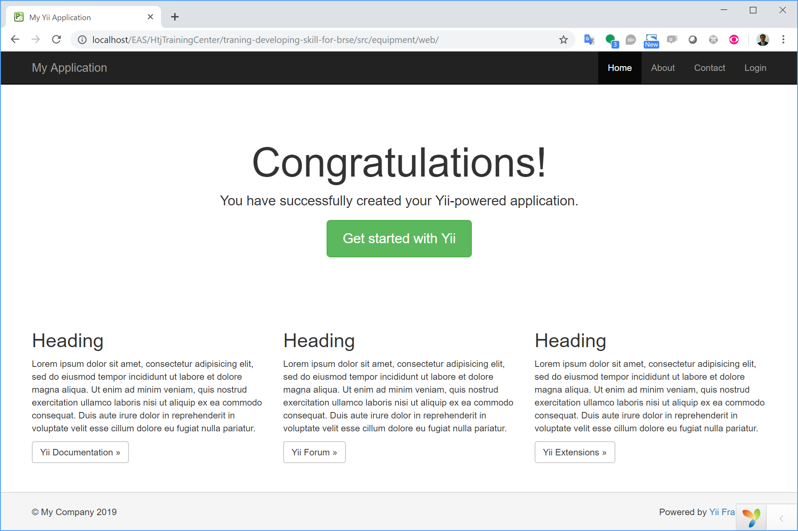
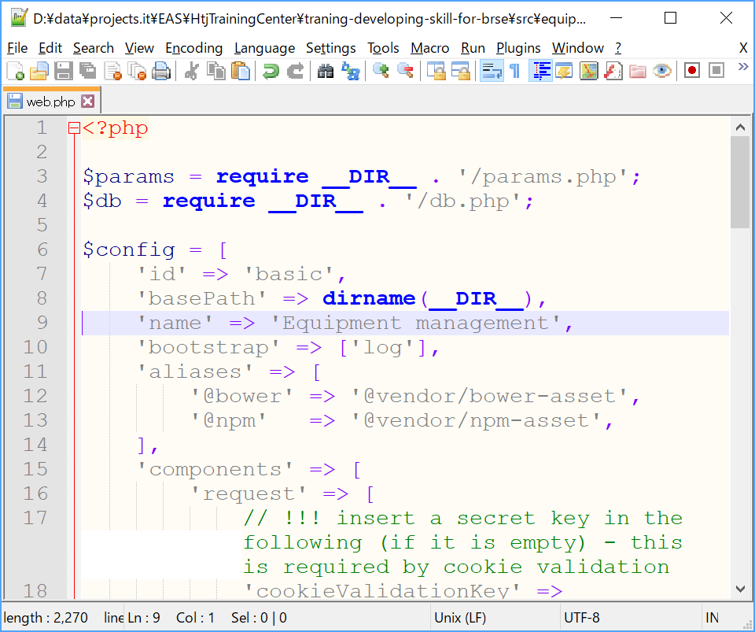
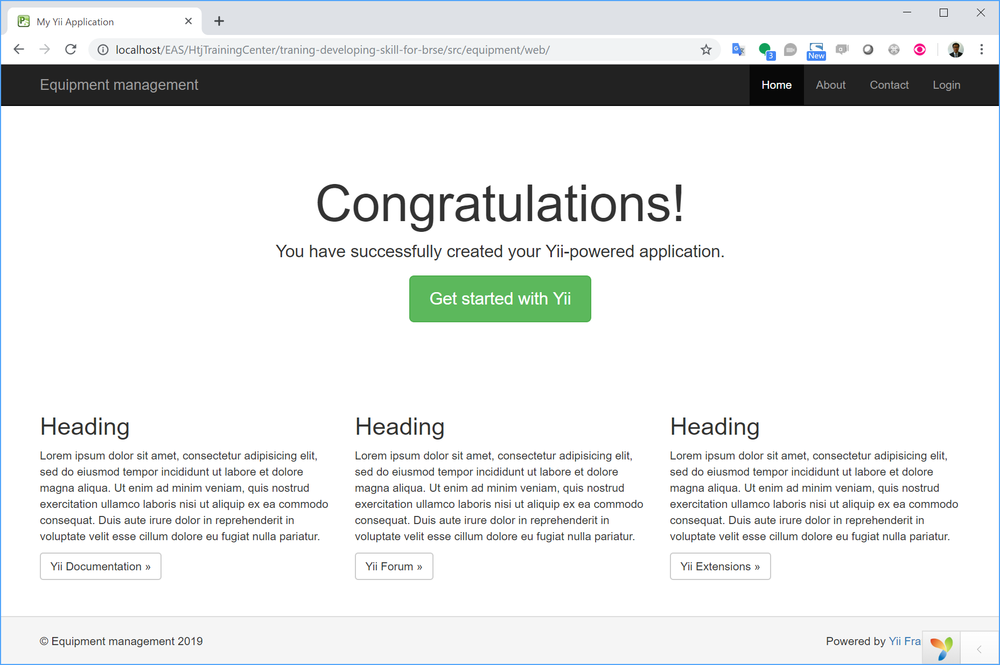

# Create Equipment management system

1. Create basic application template.
  ```
  composer create-project yiisoft/yii2-app-basic equipment
  ```
  
2. Access from web browser to confirm that the application work.
  
3. Get familiar with Yii application by edit configuration
  Open *src\equipment\config\web.php*, add `'name' => 'Equipment management',` into *$config*.
  
  Open *src\equipment\views\layouts\main.php*, change *My Company* to <?= Yii::$app->name ?>
  
  Now the application name on the header (menu) and footer has been changed.
  
