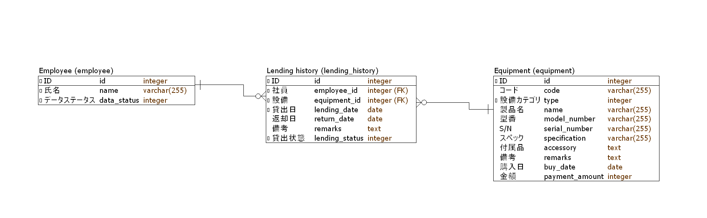
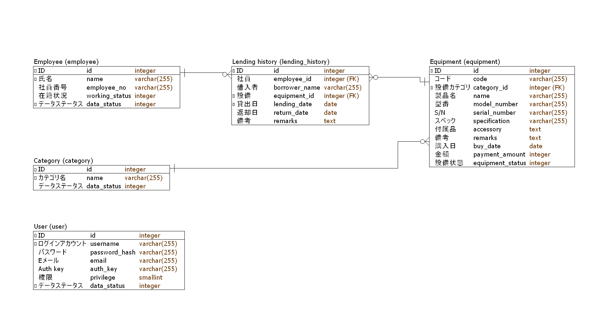

# Schema migration

Schema migration that we're talking about here is to update or revert database schema.
It is different to database migration, which means to move database between platforms when we re-develop a system.

We've used Yii2 migration to create database tables in the lesson [Create DB schema, model, CRUD](../crud/README.md#create-tables-using-migration)

In that day, our database structure were simple.



Now we decide that we will change the database structure



TODO Important point of migration

The reasons that we want to change the database structure are:
* Add or remove columns.
* Change data type.
* Rename some columns of table.

Reference: [Database Migration](https://www.yiiframework.com/doc/guide/2.0/en/db-migrations)

## Some tips and note
* *Don't* edit migration file that is shared (committed) to another team member. You must add new migration file to do what you want to change.
* Migration down is reverse steps of migration up.
* Change database structure depends on the SQL system function. MySQL and PostgreSQL support most function such as rename or change data type and constraint of a column, but SQLite don't support most of them.

## Example
* Add or remove columns. In this example, we also add NOT NULL condition to a column (and remove it on migration down).
  ```php
  class m190820_145700_make_employee_name_not_null extends Migration
  {
      protected $table = 'employee';

      public function safeUp()
      {
          $this->alterColumn($this->table, 'name', $this->string()->notNull());
          $this->addColumn($this->table, 'employee_no', $this->string());
          $this->addColumn($this->table, 'working_status', $this->integer());
      }

      public function safeDown()
      {
          $this->dropColumn($this->table, 'working_status');
          $this->dropColumn($this->table, 'employee_no');
          $this->alterColumn($this->table, 'name', $this->string());
      }
  }
  ```
* Rename columns. In this example, we rename a column *type* to *category_id* and also change it's type (add NOT NULL constraint).
  ```php
  class m190820_150237_rename_equipment_type_to_category_id extends Migration
  {
      protected $table = 'equipment';

      public function safeUp()
      {
          $this->renameColumn($this->table, 'type', 'category_id');
          $this->alterColumn($this->table, 'category_id', $this->integer()->notNull());
          $this->alterColumn($this->table, 'name', $this->string()->notNull());
          $this->addColumn($this->table, 'equipment_status', $this->integer());
      }

      public function safeDown()
      {
          $this->dropColumn($this->table, 'equipment_status');
          $this->alterColumn($this->table, 'name', $this->string());
          $this->alterColumn($this->table, 'category_id', $this->integer());
          $this->renameColumn($this->table, 'category_id', 'type');
      }
  }
  ```

* Add or remove table. Just create new migrations file such as we have done.
  ```php
  class m190821_074456_create_category_table extends Migration
  {
      protected $table = 'category';

      /**
       * {@inheritdoc}
       */
      public function safeUp()
      {
          $this->createTable($this->table, [
              'id' => $this->primaryKey(),
              'name' => $this->string(),
              'data_status' => $this->integer(),
          ]);
      }

      public function safeDown()
      {
          $this->dropTable($this->table);
      }
  }
  ```
  ```php
  <?php

  use yii\db\Migration;

  class m190821_074507_create_system_user_table extends Migration
  {
      protected $table = 'system_user';

      public function safeUp()
      {
          $this->createTable($this->table, [
              'id' => $this->primaryKey(),
              'username' => $this->string(),
              'password_hash' => $this->string(),
              'email' => $this->string(),
              'auth_key' => $this->string(),
              'privileges' => $this->integer(),
              'data_status' => $this->integer(),
          ]);
      }

      public function safeDown()
      {
          $this->dropTable($this->table);
      }
  }
  ```