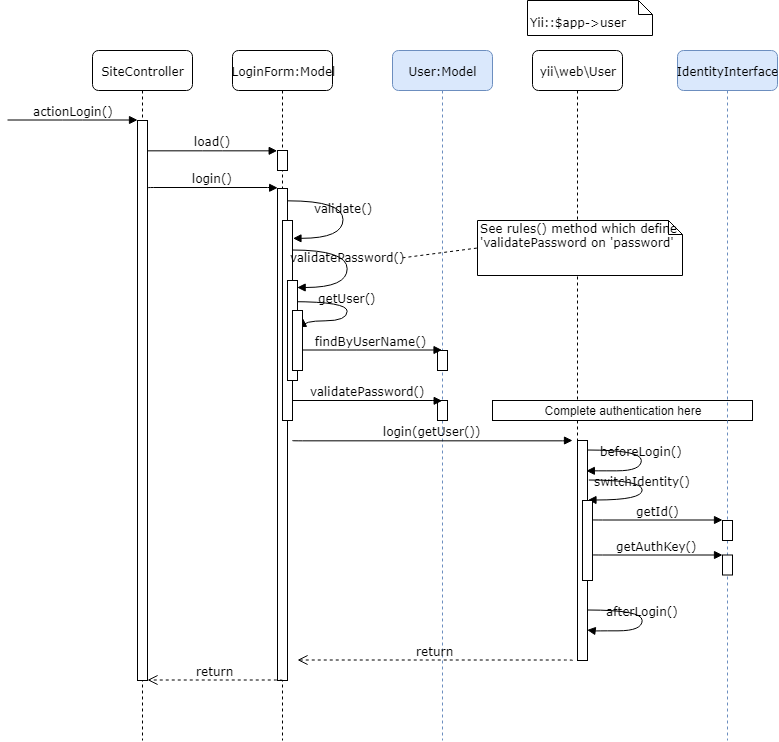

# Security

## Introduce Log and Debug

* Display logs in debug tool
  
* Application flow
  

## Login

* Login mechanism
  
* Action Login flow
  

## Password

* Don't store plain password.
* One way encoding.

## Authorization

## Pattern, framework, interface

## Other concept

* [Authentication clients](https://www.yiiframework.com/extension/yiisoft/yii2-authclient/doc/guide/2.2/en)

## References

* [Yii2: How exactly does user authentication works?](https://stackoverflow.com/questions/27353263/yii2-how-exactly-does-user-authentication-works)
* https://www.yiiframework.com/doc/guide/2.0/en/security-authentication
* https://www.yiiframework.com/doc/guide/2.0/en/security-authorization
* https://www.yiiframework.com/doc/guide/2.0/en/security-best-practices
* [Design patterns](https://www.oodesign.com/)